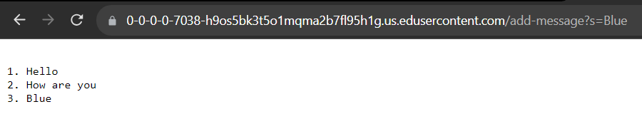
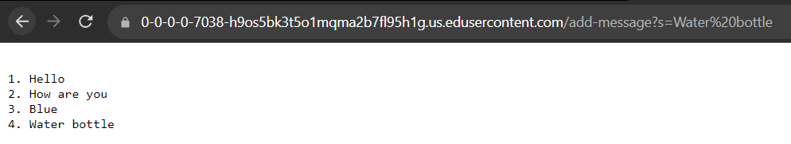
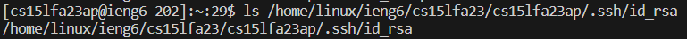
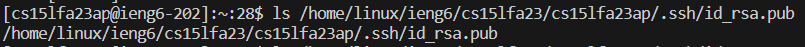
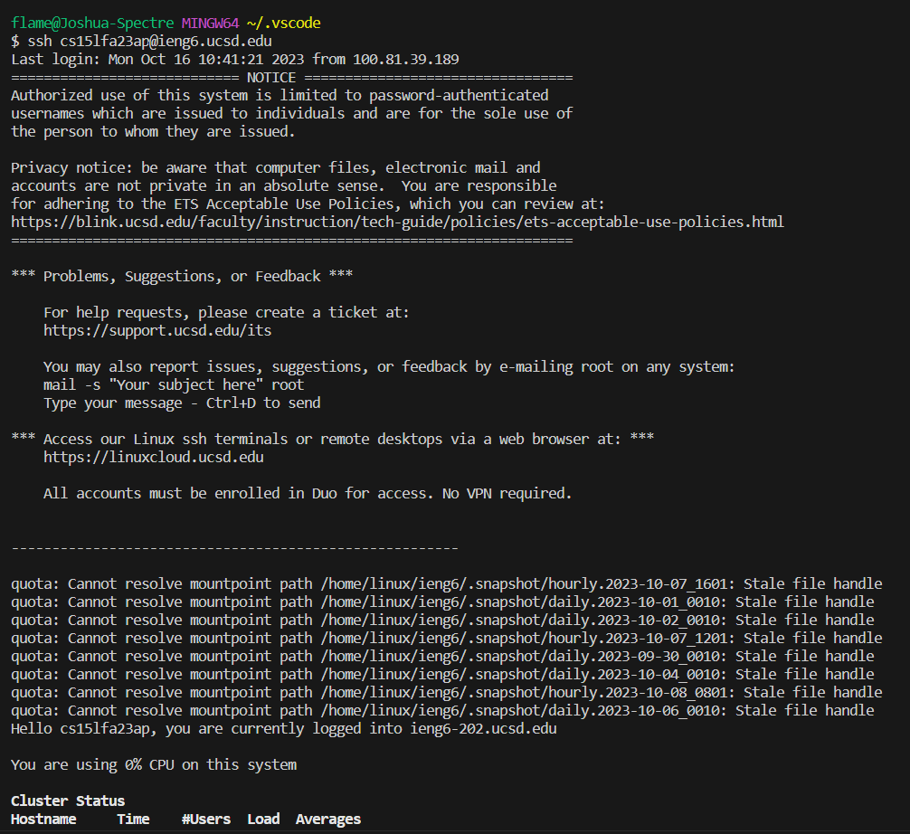

# Lab Report 2

## Part 1

**Code for StringServer**
```
import java.io.IOException;
import java.net.URI;

class Handler implements URLHandler {
    // The one bit of state on the server: a number that will be manipulated by
    // various requests.
    String[] list = new String[50];
    int Ind = 0;

    public String handleRequest(URI url) {
        if (url.getPath().equals("/")) {
            return makeList(this.list);
        } else {
            if (url.getPath().contains("/add-message")) {
                String[] parameters = url.getQuery().split("=");
                if (parameters[0].equals("s")) {
                    list[this.Ind] = parameters[1].replace("+", " ");
                    this.Ind++;
                    return makeList(this.list);
                }
            }
            return "404 Not Found!";
        }
    }
    public String makeList(String[] lis){
        String newlist= "";
        for(int i = 0; i < lis.length; i++){
            if(lis[i] != null){
                newlist += "\n" + (i + 1)+ ". " + lis[i];
            } 
        }
        return newlist;
    }
}


class StringServer {
    public static void main(String[] args) throws IOException {
        if(args.length == 0){
            System.out.println("Missing port number! Try any number between 1024 to 49151");
            return;
        }

        int port = Integer.parseInt(args[0]);

        Server.start(port, new Handler());
    }
}
```

**Screenshots**

The handleRequest and makeList methods were called. The argument for handleRequest was the url, so https://0-0-0-0-7038-h9os5bk3t5o1mqma2b7fl95h1g.us.edusercontent.com/add-message?s=Blue, 
and the argument for makeList was the String list in the StringServer class, which at that time had 3 elements, which were "Hello", "How are you", "Blue". For this specific request, 
"Blue" was added to the String list, and the int Ind increased from 2 to 3 since the string was slotted at index 2, so the index tracker was incremented.


The handleRequest and makeList methods were called. The argument for handleRequest was the url, so https://0-0-0-0-7038-h9os5bk3t5o1mqma2b7fl95h1g.us.edusercontent.com/add-message?s=Water%20Bottle,
and the argument for makeList was the String list as mentioned previously, but this time with 4 elements, which were "Hello", "How are you", "Blue", "Water Bottle". For this specific request, 
"Water Bottle" was added to the String list, and the int Ind increased from 3 to 4 since the string was slotted at index 3, so the index tracker was incremented.

## Part 2

**Path to Private Key**



**Path to Public Key**



**Screenshot of Login without Password**



## Part 3
Something I didn't know from week 2 lab was using the query method to manipulate a url. At first, when I was looking through the NumberServer.java code, I was confused as to how most of it worked.
After investigating and using the code more, I learned about how the method uses a question mark to indicate a query, and how you can access the method directly in the url of a web server.
