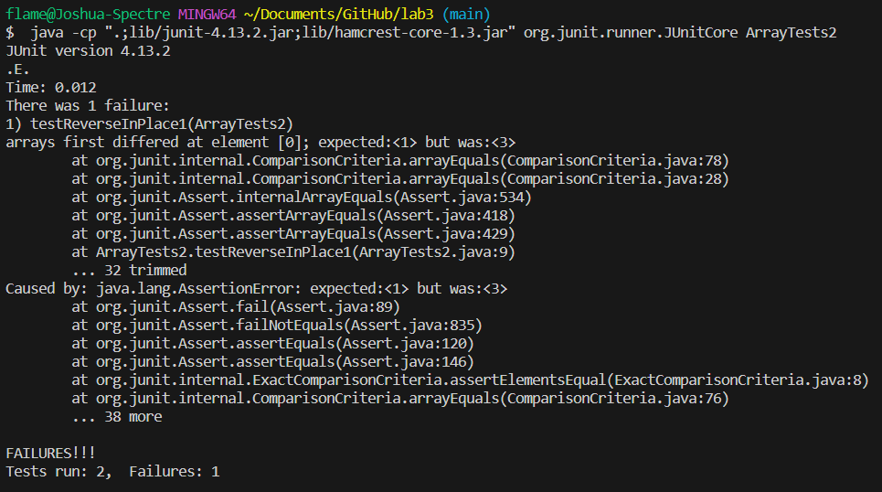

# Lab Report 3
## Part 1 - Bugs
**Failure Inducing Input**
```
@Test 
	public void testReverseInPlace1() {
    int[] input1 = { 3,2,1 };
    ArrayExamples.reverseInPlace(input1);
    assertArrayEquals(new int[]{ 1,2,3 }, input1);
	}
```
**Input that does not Induce Failure**
```
@Test 
	public void testReverseInPlace2() {
    int[] input1 = { 1 };
    ArrayExamples.reverseInPlace(input1);
    assertArrayEquals(new int[]{ 1 }, input1);
	}
```
**Running Both Tests with JUnit**

**Bug Before**
```
static void reverseInPlace(int[] arr) {
    for(int i = 0; i < arr.length; i += 1) {
      arr[i] = arr[arr.length - i - 1];
    }
  }
```
**Bug After**
```
static void reverseInPlace(int[] arr) {
    for(int i = 0; i < arr.length/2; i += 1) {
      arr[i] = arr[arr.length - i - 1];
    }
  }
```
This fix addresses the issue since the problem was iterating through the whole array, swapping an element with index i with the element of index arr.length - i - 1 resulted in the latter half of the iterations 
causing the array to return to its original state, instead of reversing it. From 1 to arr.length/2, the array gets reversed correctly, which is why that is the bug fix.
## Part 2 - Researching Commands
**grep -c**
```
flame@Joshua-Spectre MINGW64 ~/Documents/GitHub/docsearch (main)
$ grep -c sugar technical/biomed/gb-2002-3-5-research0024.txt
1

flame@Joshua-Spectre MINGW64 ~/Documents/GitHub/docsearch (main)
$ grep -c genes technical/biomed/gb-2002-3-5-research0024.txt
14
```
This command searches a file, and gives the number of lines that contain the given pattern, so in the two examples above, we can see there is a single line in the file with the word "sugar", and 14 lines with
the word "genes". This can be helpful in searching through files containing a list of data and narrowing down certain results.

**grep -i**
```
flame@Joshua-Spectre MINGW64 ~/Documents/GitHub/docsearch (main)
$ grep -i "Mr. Annan" technical/plos/journal.pbio.0020001.txt
        the world scientific community closer to each other (Annan 2003). Mr. Annan stressed the
        development itself.” Indeed, Mr. Annan's sentiments have also been echoed recently by   
        developing worlds actually remaining unchanged or even increasing, as Mr. Annan has     
        to travel, we feel optimistic that the bridges mentioned by Mr. Annan are slowly being  

flame@Joshua-Spectre MINGW64 ~/Documents/GitHub/docsearch (main)
$ grep -i "mr. aNNan" technical/plos/journal.pbio.0020001.txt
        the world scientific community closer to each other (Annan 2003). Mr. Annan stressed the
        development itself.” Indeed, Mr. Annan's sentiments have also been echoed recently by
        developing worlds actually remaining unchanged or even increasing, as Mr. Annan has
        to travel, we feel optimistic that the bridges mentioned by Mr. Annan are slowly being
```
This command searches a file, and lists all the lines containing the given pattern, with its main purpose as a case insensitive search. In the examples above, we can see both commands provide the same output,
yet in the second command, the upper and lowercase do not match the search results. This can be useful in most searches since most of the time, we don't care if the data we are looking for is in uppercase or 
lowercase. Specifically in cases where words are in the beginning of a sentence, as those whould have an uppercase letter.

**grep -n**
```
flame@Joshua-Spectre MINGW64 ~/Documents/GitHub/docsearch (main)
$ grep -n  "counterterrorism" technical/911report/chapter-12.txt
731:            Practically every aspect of U.S.counterterrorism strategy relies on international
868:                    remain front and center in U.S. counterterrorism efforts. The government has
969:                lack of well-developed counterterrorism measures as a part of border security and an
971:                counterterrorism. These weaknesses have been reduced but are far from being
991:                a vital part of counterterrorism strategy. Better technology and training to detect
1003:                government counterterrorism community.
1088:                rule of law, yet serve equally well as a vital element of counterterrorism.
1343:                the immigration laws as a tool in its counterterrorism effort. Even without the

flame@Joshua-Spectre MINGW64 ~/Documents/GitHub/docsearch (main)
$ grep -n  "martyr" technical/911report/chapter-13.5.txt
80:                martyrdom. Hamlan and Nami eventually agreed to approach Abu Hafs al Mauritani about
85:                become martyrs:"I want to be one of this religion's bricks and glorify this
88:                expectations for martyrs and instructed them on using coded telephone numbers. He
119:                videotape of Jdey's martyrdom statement was found in the rubble of Atef 's house
120:                near Kabul following a November 2001 airstrike, together with a martyrdom video of
```
This command searches a file and lists the lines that contain the given pattern, as well as the corresponding line number. In the first example, we can see which lines have the word "counterterrorism" in the file
technical/911report/chapter-12.txt, as well as the line numbers they are in the file. Similarly for the second example, we can see which lines have the word "martyr" in the file technical/911report/chapter-13.5.txt,
as well as the line numbers they are in the file. This command can be especially useful when searching for information that requires context, since having the line number means you can look in the file and examine
before and after the line you are interested in.

**grep -w**
```
flame@Joshua-Spectre MINGW64 ~/Documents/GitHub/docsearch (main)
$ grep -w "quest" technical/government/Alcohol_Problems/Session2-PDF.txt
minutes). Most of the quest to develop efficient ED screening has
27. Selzer M. The Michigan Alcoholism Screening Test: the quest

flame@Joshua-Spectre MINGW64 ~/Documents/GitHub/docsearch (main)
$ grep -w "state" technical/government/About_LSC/Comments_on_semiannual.txt 
in March 2001, highlights the state planning successes of 18 states
bonds among stakeholder partners in each state's civil justice
state communities of justice - integrated and coordinated legal
state, regional, and national level.
many areas of state planning including, but not limited to,
development and implementation of state plans, resource
of central databases for a program, region, or state, using various
conference of representatives from legal services, state courts,
```
This command searches a file and lists the lines that contain the given pattern as a full word. In the first example, even though there are many lines containing "questions", grep -w only lists the ones with "quest"
since that is what was the given pattern. Similarly for the second example, there are lines in the file with the word "states", but those arent listed as the given pattern was just "state". This command is helpful 
when the word you are searching for is a common substring of other words, and you arent interested in the other words.

Source of how I found all 4 commands: https://www.geeksforgeeks.org/grep-command-in-unixlinux/


