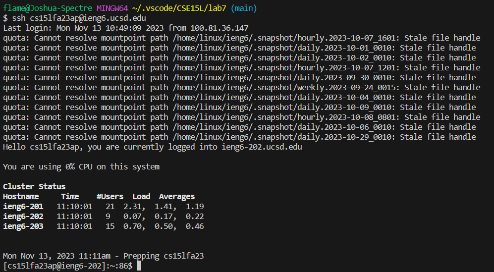
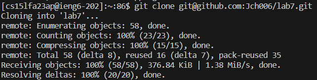
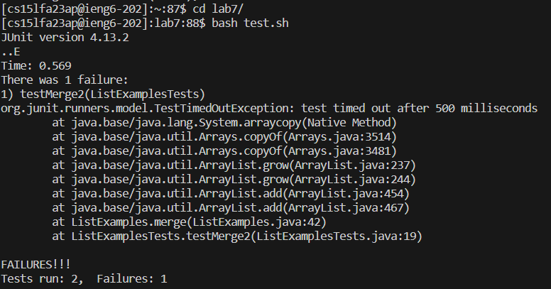
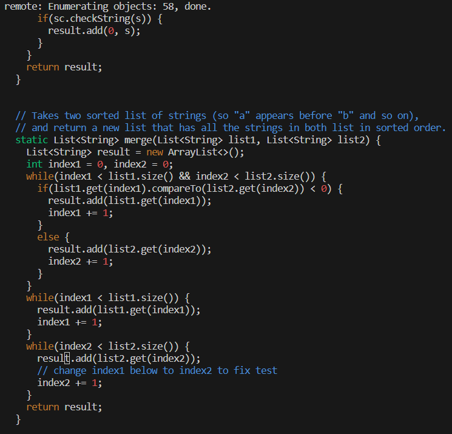
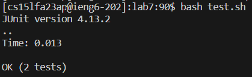
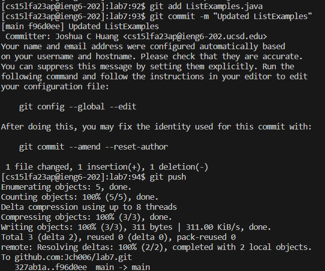

# Lab Report 4
**Steps**

4. Keys Pressed: `ssh cs15lfa23ap@ieng6.ucsd.edu<enter>`

5. Keys Pressed: `git clone git@github.com:Jch006/lab7.git<enter>`

6. Keys Pressed: `cd l<tab><enter>`(tab to autocomplete lab7/), `bash t<tab><enter>`(tab to autocomplete test.sh)

7. Keys Pressed: `vim L<tab>.<tab><enter>`(first tab to autocomplete ListExamples, second tab to autocomplete .java), `6<up>, 11<right>, x, i, 2, <esc>, :wq<enter>`

8. Keys Pressed: `<up><up><enter>`(bash test.sh was 2 lines above, so pressing up arrow twice allows me to access it)

9. Keys Pressed: `git add L<tab><enter>`(tab to autocomplete ListExamples.java), `git commit -m "Updated ListExamples"<enter>`, `git push<enter>`

