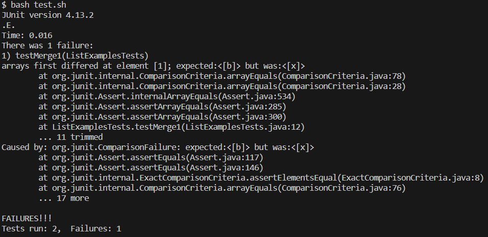
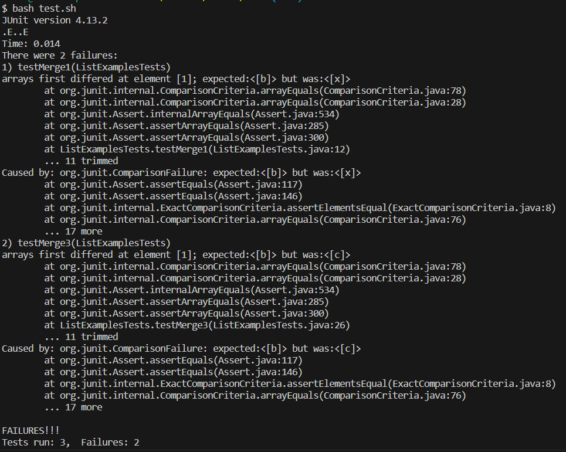
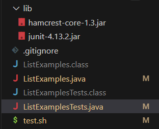
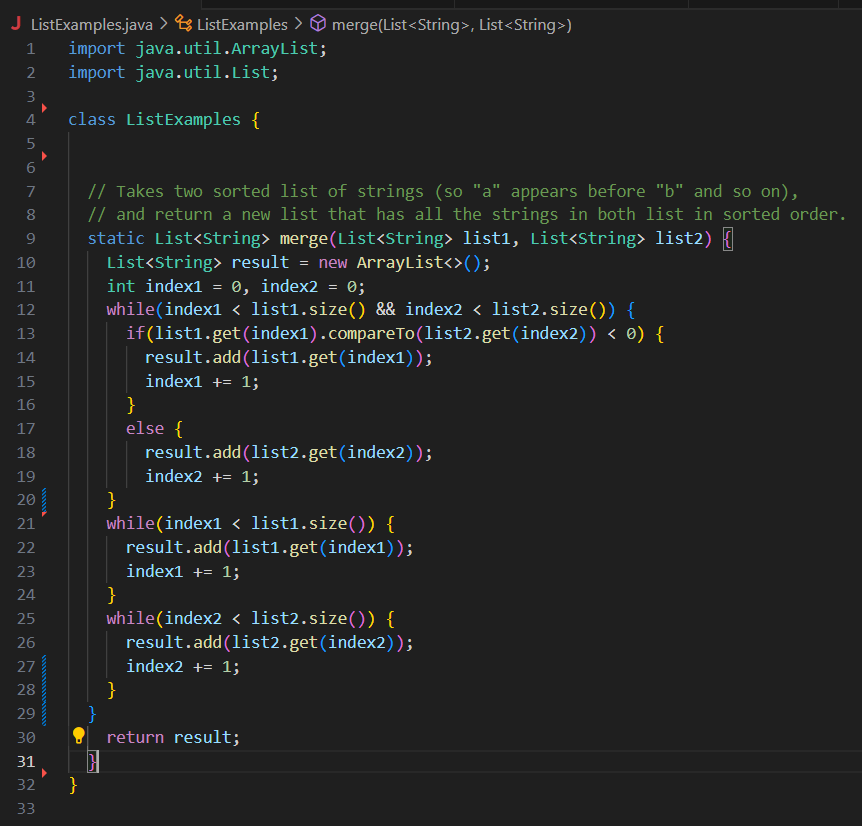
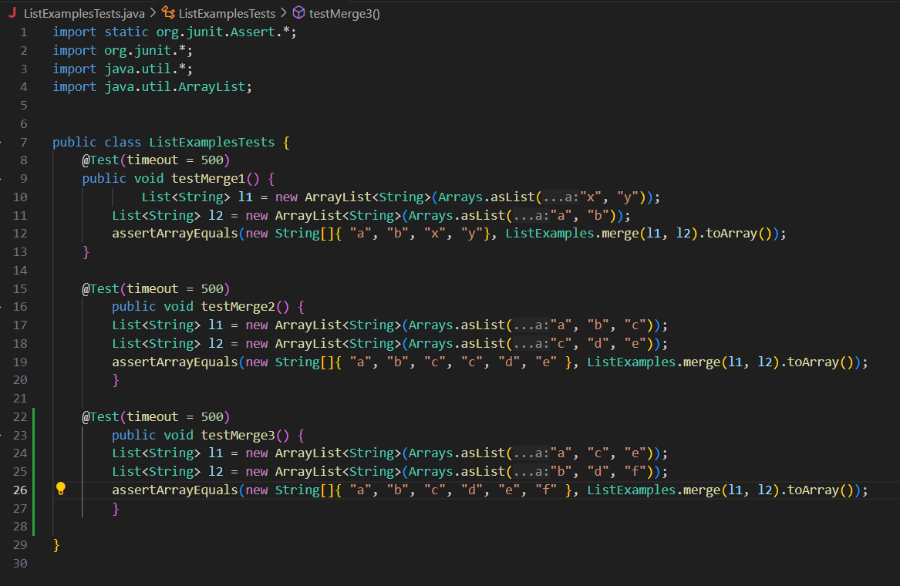

# Lab Report 5

## Part 1
**Student Post**

One of my JUnit tests is failing and I'm not sure why. My guess is it has to do with when the two lists have to be woven together instead of appended to each other since the second test passes.



**TA Response**

Try writing another test with intersecting lists for merge, and see if you can pinpoint at in what situation things start to go wrong. What is the pattern with the expected and the actual values?

**Terminal screenshot with suggestion**

The bug was a misplaced bracket, causing list1 to always be appended after the first element, only then would list2 be added to the final array.



**Information about set up**





Command to trigger the bug: ```bash test.sh```

To fix the bug, move the bracket right above ```return result;``` to above the second ```while``` loop.


## Part 2
Something I learned from lab during the second half of the quarter was using vim, which I had previously never even heard of. In the past I have wondered if you could access files from the command line, and learning about vim was pretty interesting. Switching between different modes and using different keypresses to do different things was quite fun and also confusing at times, but I do think this skill could be quite useful for certain situations.
